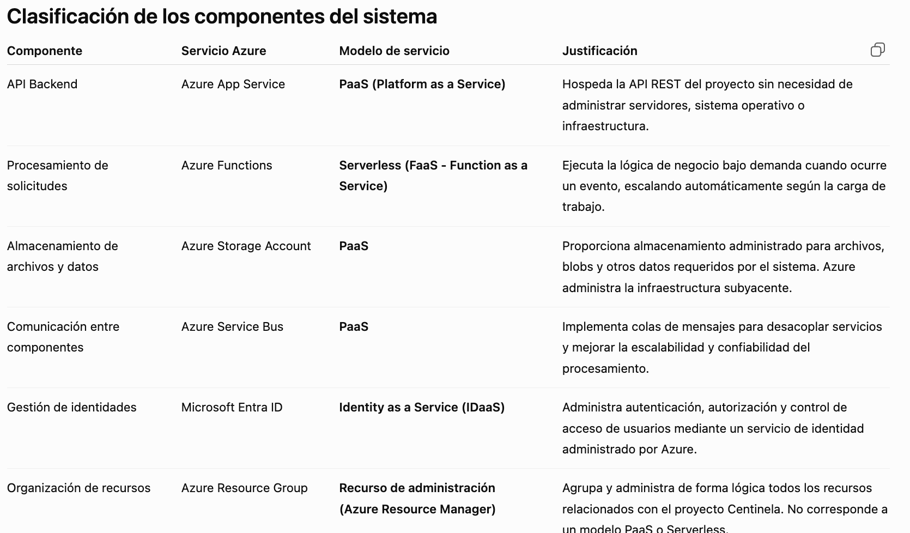

## INDICE
- Convenciones de nombres.
- Clasificación PaaS/Serverless.
- Responsabilidad compartida.
- Reglas para Storage Account.
- Ejemplos de nombres.
- Buenas prácticas.

## Crear una regla de nombres por proyecto, tipo de recurso y ambiente

¿Qué significa?

No puedes crear recursos con nombres aleatorios.

Por ejemplo, esto estaría mal:

- storage1
- storageandrea
- prueba
- funcionjuan

Debe existir una convención para que cualquier persona sepa qué recurso está viendo.

Para Centinela podríamos usar:

Servicio	                Nombre

Resource Group	            rg-centinela-dev
Storage Account	            st-centineladev01
Service Bus	                sb-centinela-dev
Function App	            func-centinela-dev
App Service	                app-centinela-dev

## Nombres Globalmente Únicos

En Azure, algunos recursos pueden repetirse, Por ejemplo:

rg-centinela-dev

y otra empresa también, no pasa nada, pero una Storage Account funciona diferente.

Su nombre es único en todo Azure, 

No solo dentro de mi suscripción.
No solo dentro de Colombia.
Sino en TODO Azure.

Por eso no puede ponerse simplemente

- storagecentinela: Seguramente ya existe!

# Clasificacion de Servicio

Clasificación de los componentes del sistema
Que tipo de servicio es?

# Clasificación de los componentes del sistema

Antes de clasificar los servicios que utilizará Centinela, es importante comprender qué significa cada modelo de servicio en la nube.

## ¿Qué es PaaS (Platform as a Service)?

PaaS significa **Platform as a Service** o **Plataforma como Servicio**.

En este modelo, Azure proporciona una plataforma completamente administrada para que los desarrolladores puedan ejecutar sus aplicaciones sin preocuparse por la infraestructura.

Esto significa que Azure administra:

- Los servidores físicos.
- El sistema operativo.
- El almacenamiento físico.
- La red.
- La seguridad de la infraestructura.
- Las actualizaciones del sistema.

Mientras tanto, el equipo de desarrollo únicamente administra:

- El código de la aplicación.
- La configuración del servicio.
- Los datos del negocio.
- La lógica del sistema.

Un ejemplo claro es **Azure App Service**. El equipo simplemente publica la aplicación y Azure se encarga de toda la infraestructura necesaria para ejecutarla.

---

## ¿Qué es Serverless (FaaS)?

Serverless significa **"sin servidor"**, aunque realmente existen servidores; simplemente el desarrollador no necesita administrarlos.

En este modelo únicamente se desarrolla el código que ejecutará una determinada tarea y Azure se encarga automáticamente de:

- Ejecutar la función cuando ocurre un evento.
- Escalar la aplicación según la demanda.
- Administrar los servidores.
- Administrar el sistema operativo.
- Administrar la infraestructura.

En Centinela este modelo corresponde a **Azure Functions**, donde cada función ejecutará una tarea específica dentro del flujo de procesamiento.

---

## ¿Qué es Identity as a Service (IDaaS)?

Identity as a Service es un servicio especializado en administrar la identidad de los usuarios.

En lugar de desarrollar un sistema propio de autenticación, Azure proporciona Microsoft Entra ID para gestionar:

- Inicio de sesión.
- Autenticación.
- Autorización.
- Usuarios.
- Roles.
- Permisos.

De esta manera el equipo únicamente administra quién puede acceder al proyecto y qué permisos posee cada integrante.

---

## ¿Qué es un recurso de administración?

No todos los servicios pertenecen a un modelo como PaaS o Serverless.

Algunos recursos existen únicamente para organizar la infraestructura.

El ejemplo más claro es **Azure Resource Group**, cuya función consiste en agrupar todos los recursos relacionados con un mismo proyecto para facilitar su administración.

---

# Clasificación de los componentes del sistema

Antes de clasificar los servicios que utilizará Centinela, es importante comprender qué significa cada modelo de servicio en la nube.

## ¿Qué es PaaS (Platform as a Service)?

PaaS significa **Platform as a Service** o **Plataforma como Servicio**.

En este modelo, Azure proporciona una plataforma completamente administrada para que los desarrolladores puedan ejecutar sus aplicaciones sin preocuparse por la infraestructura.

Esto significa que Azure administra:

- Los servidores físicos.
- El sistema operativo.
- El almacenamiento físico.
- La red.
- La seguridad de la infraestructura.
- Las actualizaciones del sistema.

Mientras tanto, el equipo de desarrollo únicamente administra:

- El código de la aplicación.
- La configuración del servicio.
- Los datos del negocio.
- La lógica del sistema.

Un ejemplo claro es **Azure App Service**. El equipo simplemente publica la aplicación y Azure se encarga de toda la infraestructura necesaria para ejecutarla.

---

## ¿Qué es Serverless (FaaS)?

Serverless significa **"sin servidor"**, aunque realmente existen servidores; simplemente el desarrollador no necesita administrarlos.

En este modelo únicamente se desarrolla el código que ejecutará una determinada tarea y Azure se encarga automáticamente de:

- Ejecutar la función cuando ocurre un evento.
- Escalar la aplicación según la demanda.
- Administrar los servidores.
- Administrar el sistema operativo.
- Administrar la infraestructura.

En Centinela este modelo corresponde a **Azure Functions**, donde cada función ejecutará una tarea específica dentro del flujo de procesamiento.

---

## ¿Qué es Identity as a Service (IDaaS)?

Identity as a Service es un servicio especializado en administrar la identidad de los usuarios.

En lugar de desarrollar un sistema propio de autenticación, Azure proporciona Microsoft Entra ID para gestionar:

- Inicio de sesión.
- Autenticación.
- Autorización.
- Usuarios.
- Roles.
- Permisos.

De esta manera el equipo únicamente administra quién puede acceder al proyecto y qué permisos posee cada integrante.

---

## ¿Qué es un recurso de administración?

No todos los servicios pertenecen a un modelo como PaaS o Serverless.

Algunos recursos existen únicamente para organizar la infraestructura.

El ejemplo más claro es **Azure Resource Group**, cuya función consiste en agrupar todos los recursos relacionados con un mismo proyecto para facilitar su administración.

                    Azure
                       │
        ┌──────────────┼──────────────┐
        │              │              │
      PaaS        Serverless       IDaaS
        │              │              │
   App Service     Functions     Entra ID
   Storage
   Service Bus

# Quien administra que? 

Responsabilidad compartida

Esta parte es muy sencilla.

Debes explicar quién administra qué.

Por ejemplo:

Componente          	          Equipo	        Azure

Código                              ✅	             ❌
API	                                ✅             	 ❌
Configuración	                    ✅	             ❌
Sistema operativo	                ❌	             ✅
Hardware	                        ❌	             ✅
Centro de datos	                    ❌	             ✅
Red física	                        ❌	             ✅