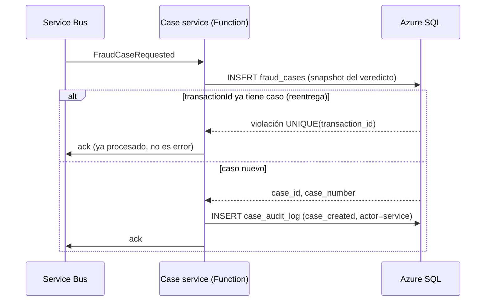
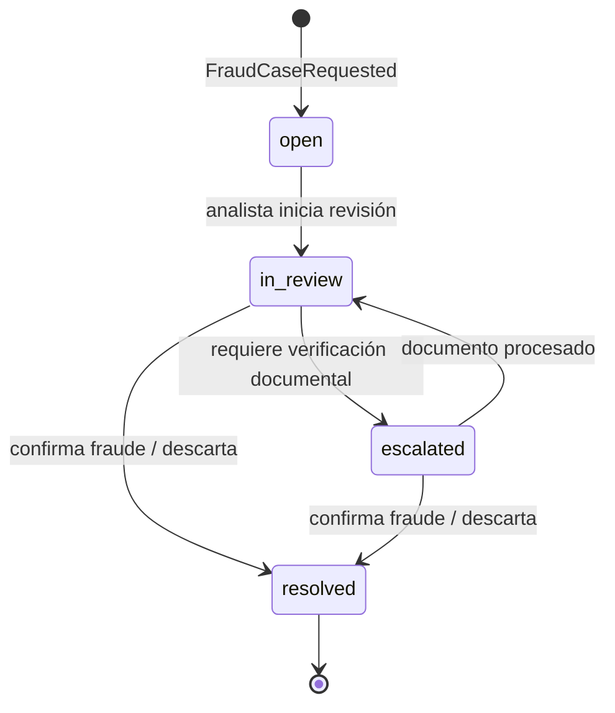

# Flujo de un caso de fraude: de `FraudCaseRequested` al cierre

Documenta el recorrido completo de un caso (T-018): cómo se abre a partir del evento, qué estados atraviesa, quién puede moverlo y qué queda auditado en cada paso.

Modelo de datos de referencia: `backend/case-service/schema.sql` y `backend/shared/models/case.py` (T-017). El contrato del evento `FraudCaseRequested` lo define T-004.

## Origen: cuándo se solicita un caso

El motor de scoring (T-013) calcula el score sumando los puntos de las reglas disparadas. **Solo cuando `score > umbral`** publica `FraudCaseRequested`, con el veredicto completo en el payload: `transactionId`, `accountId`, `correlationId`, `score`, `threshold` vigente y las reglas disparadas con su evidencia.

El cliente ya recibió su respuesta en la ingesta — nada de este flujo lo hace esperar.

## Apertura del caso

Puntos clave:

- **Idempotencia**: la mensajería es *at-least-once*. La restricción `UNIQUE(transaction_id)` convierte la reentrega en un conflicto esperado: se confirma el mensaje y no se duplica el caso.
- **El caso nace autocontenido**: score, umbral vigente y reglas con evidencia se copian del evento. La revisión y el explicador (T-019) no dependen de releer Cosmos ni de la configuración futura del umbral.
- **Estado inicial**: `open`, sin asignar.

## Estados y transiciones

| Transición | Quién | Precondición |
|---|---|---|
| `open → in_review` | Analista | Caso asignado (`assigned_to`) |
| `in_review → escalated` | Analista | Necesita verificar identidad del titular (T-021/T-022) |
| `escalated → in_review` | Analista / servicio documental | Documento adjuntado y procesado |
| `in_review → resolved`, `escalated → resolved` | Analista | Resolución registrada (`confirmed_fraud` o `dismissed`) |

`resolved` es **terminal**: no hay reapertura en el alcance del proyecto. Cualquier transición fuera de esta tabla se rechaza (la tabla vive en código en `CASE_STATUS_TRANSITIONS`).

## Resolución

El analista cierra el caso con una decisión de dos valores:

- **`confirmed_fraud`**: la transacción fue fraudulenta.
- **`dismissed`**: falsa alarma; la transacción era legítima.

La resolución es 1:1 con el caso (`case_resolutions`): quién resolvió, cuándo, con qué decisión y notas opcionales. Registrarla y pasar el caso a `resolved` ocurre en la misma transacción de base de datos.

## Qué queda auditado

Toda mutación inserta una fila en `case_audit_log` (append-only — nadie tiene UPDATE/DELETE sobre esa tabla, ver T-023/T-024):

| Acción | Actor | `details` (JSON) |
|---|---|---|
| `case_created` | `service` (case function) | evento origen, score, umbral |
| `case_assigned` | `admin` o `service` (auto-asignación) | analista asignado |
| `review_started` | `analyst` | estado anterior |
| `case_escalated` | `analyst` | motivo |
| `document_attached` | `analyst` / `service` documental | referencia al blob, resultado de extracción (T-021/T-022) |
| `case_resolved` | `analyst` | resolución, notas |

Cada fila lleva `correlation_id`: el mismo identificador que entró por la API de ingesta, atravesó el scoring y llegó al caso. Con él, el recorrido completo de la transacción es visible en el monitoreo (T-025/T-026) — desde la recepción hasta el cierre por el analista.

## Relación con el resto del sistema

- **Entrada**: `FraudCaseRequested` (contrato T-004, publicado por decisión del scoring T-013).
- **Explicación**: al abrirse el caso, el explicador (T-019) genera el texto legible desde el snapshot de reglas y evidencia; su contrato es T-020.
- **Documentos**: la escalación usa el servicio documental (T-021) con extracción por IA (T-022).
- **API**: las operaciones del analista sobre el caso se describen en [`docs/api/api-gestion-casos.md`](../api/api-gestion-casos.md).
